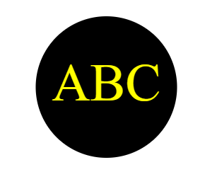

# SVG Logo Maker


## License
[](https://opensource.org/licenses/MIT)

[Description](#description)<br>
[Usage](#usage)<br>
[Features](#features)<br>
[Installation](#installation)<br>
[Tests](#tests)<br>
[Deployment](#deployment)<br>
[Credits](#credits)<br>

## Description
This is a simple SVG logo generating app built using node js.

## Usage
This app would be usefull for designers to create a simple logo based off user input criteria for logo text and colors.

## Features
* Customizable text.
* Customizable colors.
* Common color values validator built using color-name node package which checks that colors enterred as text are readable by the svg. ie: yellow is accepted, burgundy is not.
* Hexidecimal validator built using hex-color-regex node package checks wether the hexidecimal string enterred by a user isvalid.

## Installation
To install and run this application, a user should run the following commands in their git bash terminal:
 ```bash
git clone git@github.com:darylbg/logo-generator.git
```
then cd into the repo folder:
```bash
cd logo-generator.git
```
then, making sure node is installed on their machine, install all dependancies:
```bash
npm install
```
then run the application:
```bash
node index.js
```

## Tests
This application runs a number of tests on key parts of the code.
* The functionality of the Shapes module is tested. Each shape option tests the expected output of the SVG against the actual output when certain values are passed into it.
* The below validator function is built using the color-name and hex-color-regex node packages to validate that the colors and hexidecimal codes enterred by the user are valid.
```javascript
const colors = require('color-name');
const hexColorRegex = require('hex-color-regex')

const colorNames = Object.keys(colors);
function(input) {
  if (colorNames.includes(input) || hexColorRegex().test(input)) {
    return true;
  } else {
    return 'You must enter a valid color keyword or hexadecimal number'
  }
}
```
## Deployment
* This project is not deployed live but a walkthrough demonstration of it can be found [here](https://www.youtube.com/watch?v=u1KZTEBXndQ).
* Source code for this project can be found [here](https://github.com/darylbg/logo-generator).

* A sample SVG created by this app may look like this: 

## Credits
This application was made by Daryl Blough.

My github is [darylbg](https://github.com/darylbg) .

For any questions or input please use my email daryl123@gmail.com.